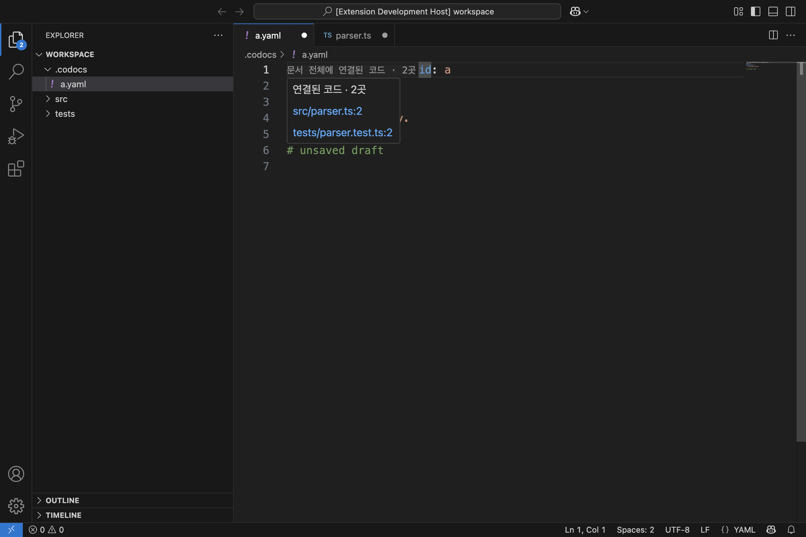
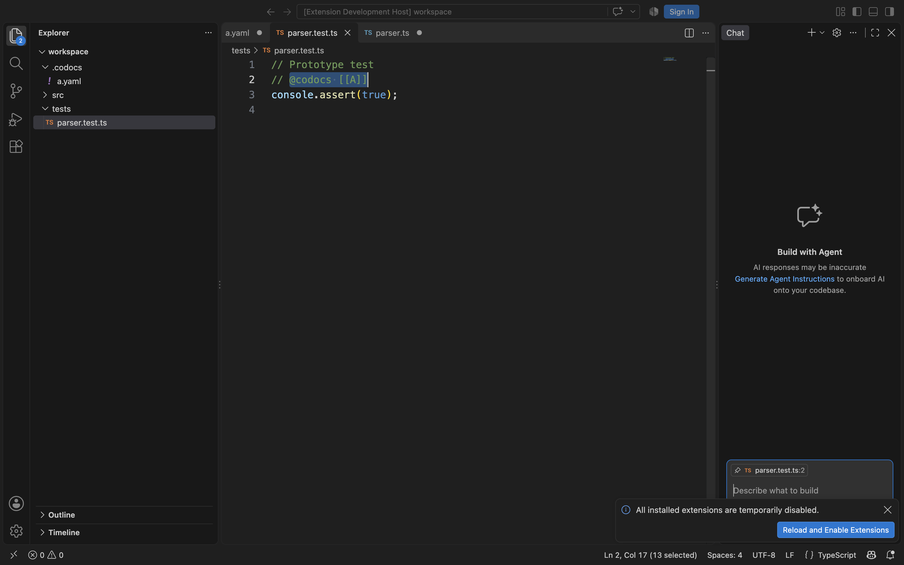

# COD-29 문서 전체 참조 표시 시제품 — 2026-09-28

문서 전체 참조의 가상 상단 표시, 복수 호버 개별 링크, 단일 직접 이동과 표시 갱신은 실제 VS Code에서 동작했다. Inlay Hint를 후보로 사용한 결과이며, 일반 클릭·별도 상단 행·사용자 설정과 무관한 표시까지 만족하는 최종 UI를 확정한 것은 아니다.

## 검증 범위

제품 확장과 분리된 작은 개발 확장을 실행했다. `.codocs/a.yaml`과 이를 참조하는 `src/parser.ts`, `tests/parser.test.ts`를 사용했다. 두 참조 위치와 연결 수는 시제품에서 고정하고 제어 파일로 2→1→0을 전달했다. 실제 참조 파서·프로젝트 파일 검색·역참조 색인·행 범위 표시·MCP 영향 안내는 구현하지 않았다.

Node.js v22.22.0, macOS arm64에서 저장소의 최소 지원 버전 1.100.0과 로컬에 캐시된 1.139.1을 각각 실행했다. 격리된 프로필에서 Inlay Hint를 켜고, DevTools Protocol의 마우스 이벤트로 실제 편집기 화면을 조작했다. 제품 API를 mock하거나 이동 명령을 테스트 코드에서 직접 호출하지 않았다. 실행한 시제품 프로세스는 검증 후 종료했다.

## 결과

| 확인한 동작                                                           | 1.100.0 | 1.139.1 |
| --------------------------------------------------------------------- | ------- | ------- |
| YAML 첫 행 앞에 가상 표시 렌더링                                      | 통과    | 통과    |
| 2곳일 때 호버에 구현·테스트의 개별 링크 표시                          | 통과    | 통과    |
| 복수 표시 일반 클릭·⌘+클릭 시 이동·선택 창 없음                       | 통과    | 통과    |
| 테스트 호버 링크가 2행의 정확한 참조 표기를 선택                      | 통과    | 통과    |
| 구현 호버 링크가 2행의 정확한 참조 표기를 선택하고 미저장 버퍼 재사용 | 통과    | 통과    |
| 2→1 갱신 후 ⌘+클릭으로 단일 위치 직접 이동                            | 통과    | 통과    |
| Inlay Hint 설정 off/on에 따라 숨김·복구                               | 통과    | 통과    |
| 1→0 갱신 후 표시 제거                                                 | 통과    | 통과    |
| YAML 원문·버전·미저장 상태·디스크와 코드 미저장 내용 보존             | 통과    | 통과    |

테스트 표기는 0부터 시작하는 열 3~~16, 구현 표기는 열 5~~18을 선택했으며 끝 열은 제외한다. 표시를 생성·갱신·제거하고 이동한 뒤에도 YAML 문서 버전은 2로 유지됐다. YAML과 구현 코드에 미리 만들어 둔 미저장 내용을 그대로 보존하고 대상 YAML 디스크 파일도 변경하지 않았다.

- [1.100.0 결과 JSON](header-prototype/1.100.0/result.json)
- [1.139.1 결과 JSON](header-prototype/1.139.1/result.json)

아래 화면의 `문서 전체에 연결된 코드 · 2곳`은 첫 행의 `id: a` 앞에 붙는 가상 표시다. `id: a`는 여전히 원문 1행이며, 표시 글자를 YAML에 삽입하지 않았다.





## 확인된 제약과 API 후보

- 단일 연결의 일반 클릭은 이동하지 않았다. 두 버전에서 macOS의 ⌘+클릭으로 이동했다. Windows/Linux의 제스처는 이번 실험에서 검증하지 않았다.
- 표시는 별도 상단 줄이 아니라 원문 첫 행 앞에 붙는다. 화면에서 첫 행이 길어질 수 있고 문서 상단을 스크롤 밖으로 보내면 함께 보이지 않는다.
- `editor.inlayHints.enabled`를 끄면 표시도 숨겨진다. 시제품의 켜기·끄기 실험은 격리된 프로필에만 적용했다. 제품에서 사용자 설정을 강제로 변경하는 정책을 정한 것은 아니다.
- 위 제약을 허용한다면 상단 표시 API 후보로 사용할 수 있다. 일반 클릭이나 독립된 상단 줄, 설정과 무관한 표시가 필수라면 다른 UI 방식을 추가로 검증해야 한다.

[VS Code 공식 API](https://code.visualstudio.com/api/references/vscode-api#InlayHintLabelPart)의 `InlayHintLabelPart.command`와 `tooltip`을 사용했다. 단일 연결은 명령을 제공하고 복수 연결은 호버 Markdown의 개별 명령 링크를 제공한다. 갱신은 `onDidChangeInlayHints`로 알린다. 원문 삽입을 위한 `textEdits`와 심볼 정의 탐색용 `location`은 설정하지 않았다.

## 재현

시제품 소스를 [source](header-prototype/source)에 `.raw`로 보관했다. 제품 패키지에서 빌드하거나 배포하는 코드가 아니다. 아래 명령은 저장소 루트에서 전용 `.workbench` 디렉터리를 새로 준비하는 예시다.

```sh
mkdir -p .workbench/cod29-header-replay/extension .workbench/cod29-header-replay/workspace/.codocs .workbench/cod29-header-replay/workspace/src .workbench/cod29-header-replay/workspace/tests
cp .github/workplans/COD-29-results/header-prototype/source/extension.cjs.raw .workbench/cod29-header-replay/extension/extension.cjs
cp .github/workplans/COD-29-results/header-prototype/source/package.json.raw .workbench/cod29-header-replay/extension/package.json
cp .github/workplans/COD-29-results/header-prototype/source/run.mjs.raw .workbench/cod29-header-replay/run.mjs
cp .github/workplans/COD-29-results/header-prototype/source/a.yaml.raw .workbench/cod29-header-replay/workspace/.codocs/a.yaml
cp .github/workplans/COD-29-results/header-prototype/source/parser.ts.raw .workbench/cod29-header-replay/workspace/src/parser.ts
cp .github/workplans/COD-29-results/header-prototype/source/parser.test.ts.raw .workbench/cod29-header-replay/workspace/tests/parser.test.ts
COD29_VSCODE_CACHE=/Users/seojaewan/Desktop/dev/codocs/.workbench/vscode-cache node .workbench/cod29-header-replay/run.mjs 1.100.0
COD29_VSCODE_CACHE=/Users/seojaewan/Desktop/dev/codocs/.workbench/vscode-cache node .workbench/cod29-header-replay/run.mjs 1.139.1
```

런처는 로컬의 `darwin-arm64-버전/vscode-darwin-arm64-버전/Visual Studio Code.app` 캐시를 사용한다. 결과와 화면은 실행마다 새 `results-버전-시각` 디렉터리에 저장한다. macOS의 IPC 경로 길이 제한 때문에 격리 프로필은 임시 디렉터리에 만든다.

초기 관찰 자동화에서는 Monaco가 공백을 NBSP로 렌더링해 표시 글자를 찾지 못했다. 공백 비교를 정규화한 뒤 통과했다. 재실행 중 긴 프로필 경로로 VS Code 기동이 실패한 경우도 있어 임시 프로필 경로로 수정했다. 위 결과는 수정된 동일 시제품의 최종 실행 결과다. 전체 제품의 성능·운영 호환성 검증으로 확대 해석하지 않는다.
